# Hi, I'm Jhonnatthan Alves!

  

---

## Languages & Frameworks

## Learning & Exploration

## Messaging & Data (Backend Specialization)

---

## Featured Projects

### [ClusterOS](https://github.com/ATClus/ClusterOS)
Uma suíte voltada para produtividade, explorando conceitos de integração de sistemas e performance.

### [Tab Focus Sync](https://github.com/ATClus/tab_focus_sync)
Extensão para Firefox desenvolvida em Rust/JS para sincronização de contexto de navegação, focada em eficiência de memória.

---

## Stats & Activity

  

